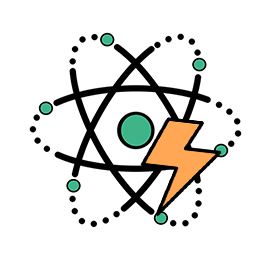
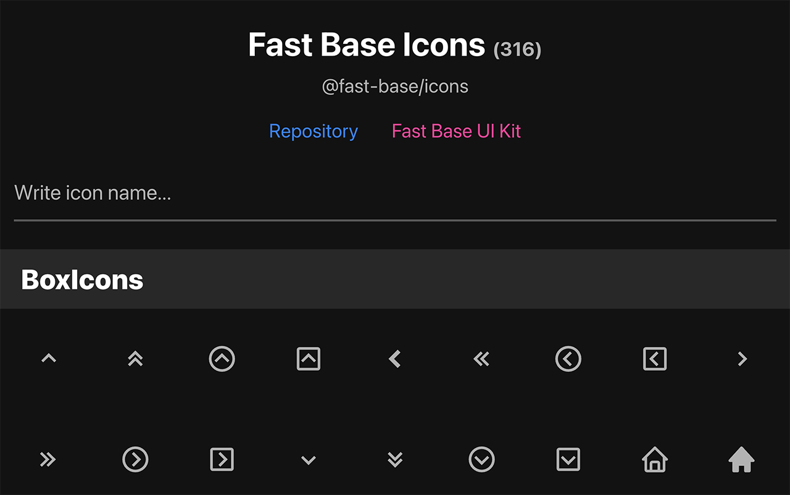

<p align="center">
  
</p>

<p align="center">
  <strong>
    Customizable, Modern and Category Based Svg Icons For React Native & Expo
  </strong>
</p>

<div align="center">
  ⭐️ Most of the icons you need to create an awesome app ⭐️
</div>

<br />

<p align="center">
  <a href="https://opensource.org/licenses/MIT">
    
  </a>
  <a href="https://twitter.com/HosseinPousti">
    
  </a>
</p>

## Introduction

Fast base icons help you incorporate a wide range of modern and stylish icons from [BoxIcons](https://github.com/atisawd/boxicons) and [Feather](https://github.com/feathericons/feather), all based on SVG, into your app. If you are interested in using a responsive, customizable, and feature-rich UI kit, I highly recommend checking out [react-native-fast-base](https://github.com/Mhp23/react-native-fast-base).

### <a href="">Explore the icons list</a> to become familiar with the available icons and easily copy them into your project

<br />

<p align="center">
  
</p>

## 💫 Features

- <strong>Cross-platform</strong>
- <strong>Easy to use</strong>
- <strong>Responsive</strong>
- <strong>Customizable</strong>
- <strong>Attractive and widely used icons</strong>

## 📀 Installation

**Yarn**:

```
yarn add @fast-base/icons
```

**NPM**:

```
npm install @fast-base/icons
```

The fast base icons are based on SVG, and you should install `react-native-svg` to use the icons. If you are using Expo, simply use the following command to install the package. Otherwise, refer to <a href="https://github.com/software-mansion/react-native-svg#installation" target="blank">the installation instructions.</a>.

```
npx expo install react-native-svg
```

## 🚀 Quick Start

```tsx
import {BHome} from '@fast-base/icons';

const MyComponent = () => {
  return <BHome mode="fill" size={24} />;
};
```

## ❤️ Support

`fast-base-icons` as an open-source project is free and always will remain free, if you like this project and think is useful give 🌟 to it.

if you need any help: [business.mhpdev@gmail.com](mailto:business.mhpdev@gmail.com)

## 🤝 Contribution

Check out the [contributing guide](/docs/CONTRIBUTING.md) to learn how to contribute to the repository and the development workflow.

## License

MIT
